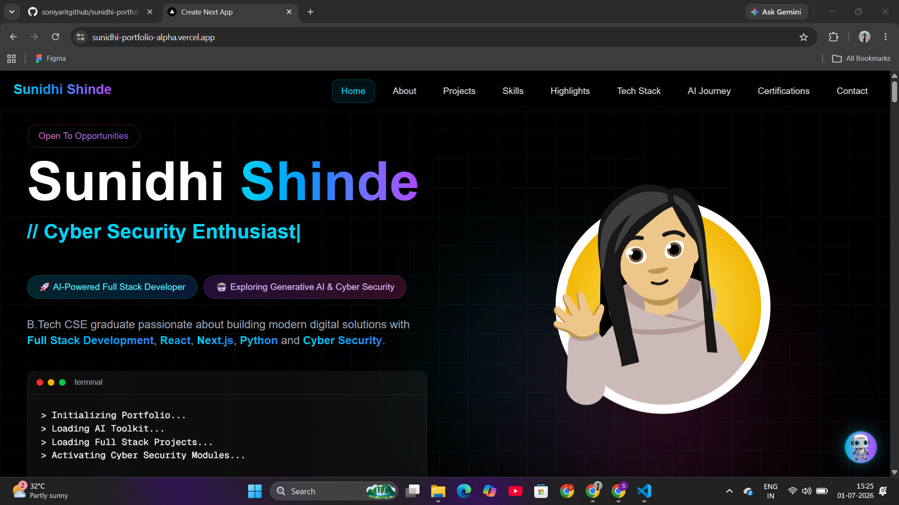
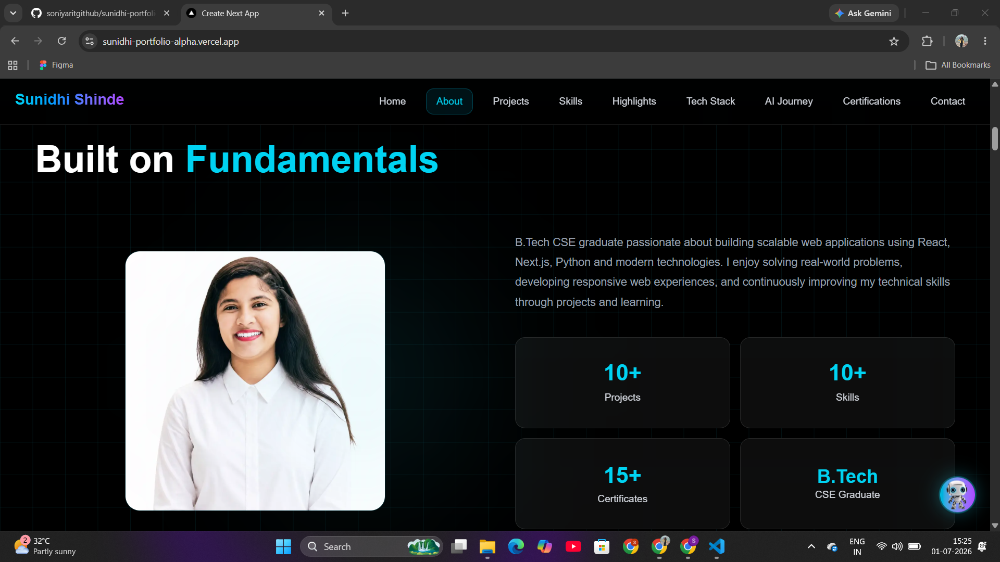
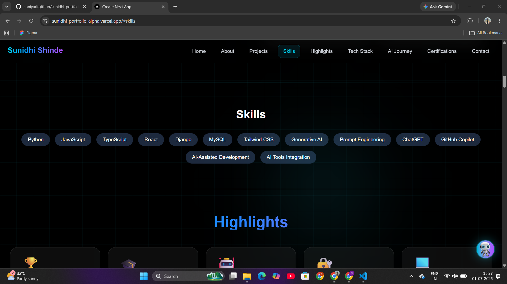
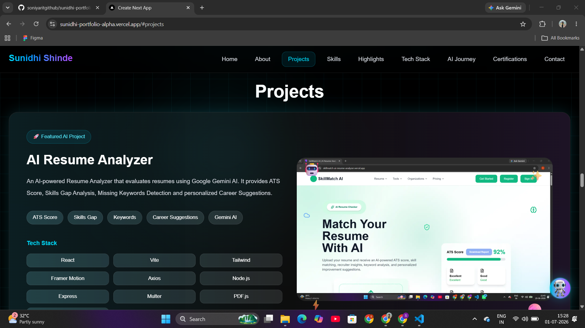
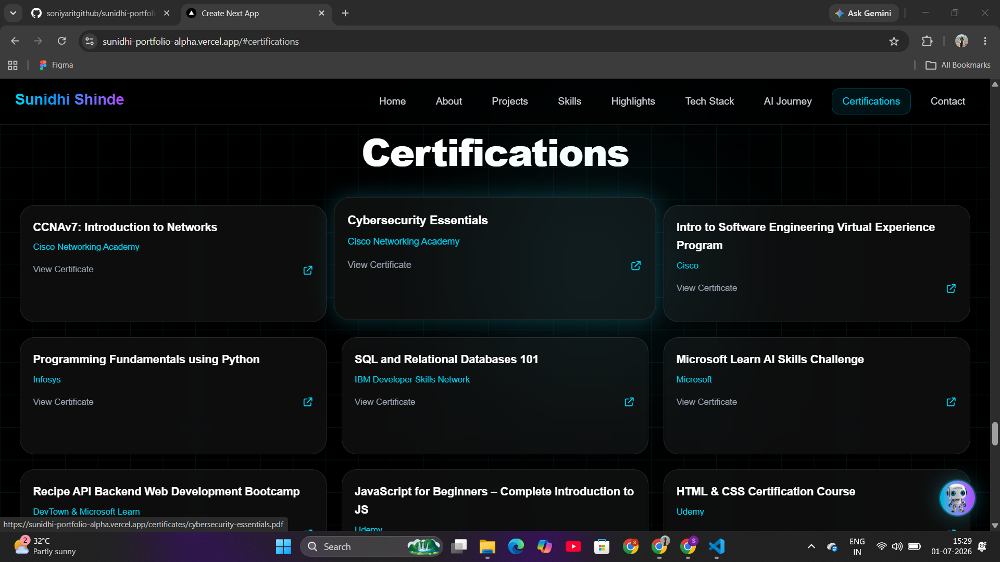
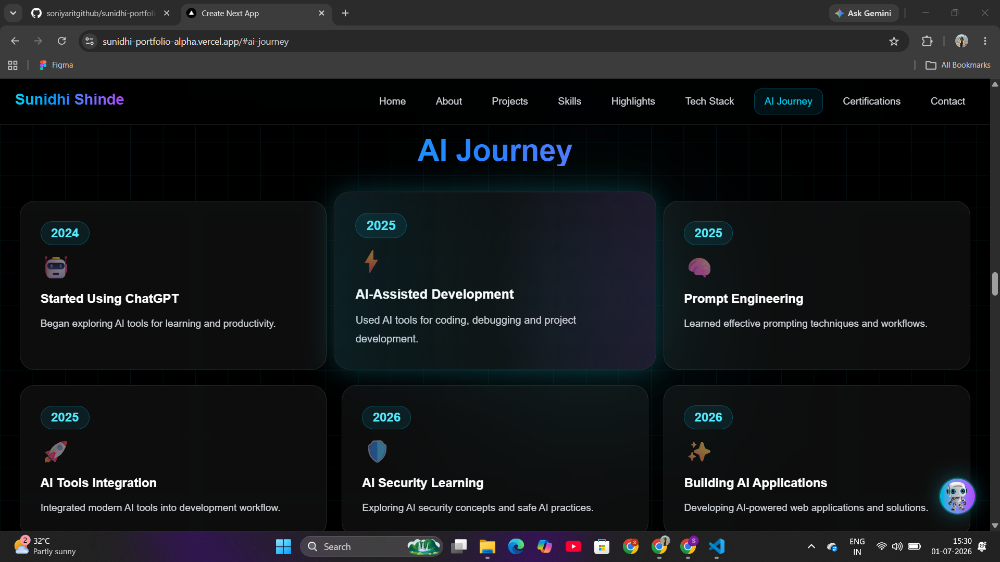
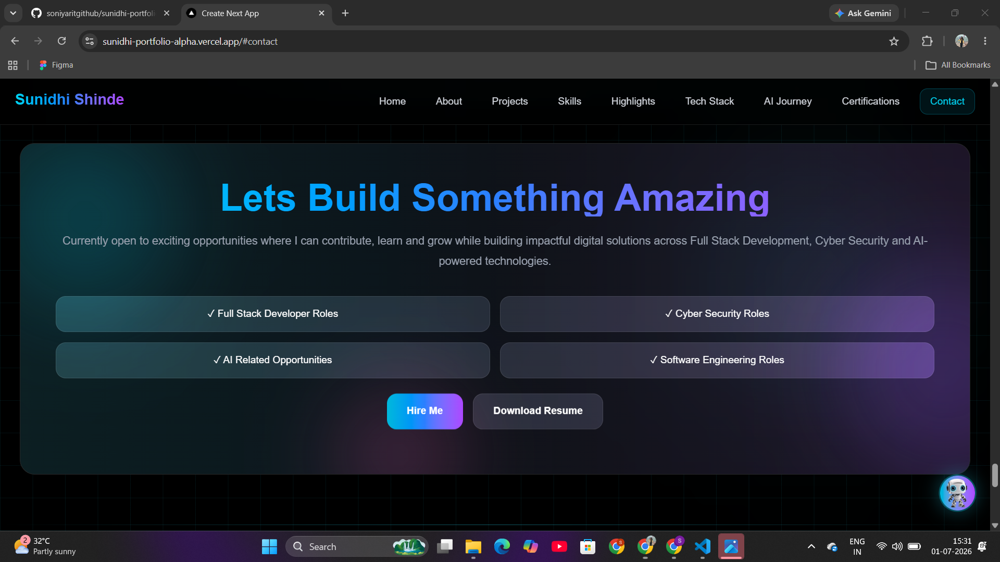

<div align="center">

# 👋 Hi, I'm Sunidhi Shinde

### Full Stack Developer | AI Enthusiast | Cybersecurity Learner

Modern AI-powered Developer Portfolio built with Next.js & TypeScript.

<br>


</div>

---

# 📸 Portfolio Preview

### 🏠 Home



---

### 👤 About



---

### 💻 Skills



---

### 🚀 Projects



---

### 🏆 Certifications



---

### 🤖 AI Journey



---

### 📩 Contact



---

# ✨ Features

- 🚀 Premium Developer Portfolio
- 🎨 Modern Glassmorphism UI
- 🌌 Animated Background Effects
- ✨ Cursor Glow Animation
- 🤖 AI Journey Timeline
- 🧠 AI Toolkit Section
- 💼 Project Showcase
- 🏆 Certifications Section
- 📝 Technical Blog Section
- 📱 Fully Responsive Design
- ⚡ Fast Performance
- 🔍 SEO Friendly
- 📄 Resume Download
- 📬 Contact Form
- 🌙 Dark Theme
- 🎯 Recruiter Friendly Layout

---

# 🛠 Tech Stack

## Frontend

- Next.js 15
- React
- TypeScript
- Tailwind CSS

## UI

- Framer Motion
- Lucide React
- CSS Animations

## Deployment

- Vercel

## Development Tools

- VS Code
- Git
- GitHub

---

# 📂 Folder Structure

```bash
portfolio
│
├── app
├── components
├── data
├── public
├── screenshots
├── package.json
└── README.md
```

---

# 🚀 Installation

Clone Repository

```bash
git clone https://github.com/soniyaritgithub/sunidhi-portfolio.git
```

Go to Project

```bash
cd sunidhi-portfolio
```

Install Packages

```bash
npm install
```

Run

```bash
npm run dev
```

Open

```
http://localhost:3000
```

---

# 📌 Portfolio Sections

- Hero
- About
- Skills
- Highlights
- Tech Stack
- AI Journey
- AI Toolkit
- Projects
- Certifications
- Blog
- Recruiter CTA
- Contact

---

# 💼 Featured Projects

### 🤖 SkillMatch AI Resume Analyzer

AI-powered Resume Analyzer using Gemini AI with ATS Score, Resume Match, Skill Gap Detection and Recruiter Insights.

---

### 🏦 SmartBank

Full Stack Online Banking System with Authentication, Dashboard and Secure Banking Features.

---

### 🔐 RBAC Authentication System

Role-Based Authentication System with JWT Security.

---

### 🎓 Student Management System

CRUD-based Student Management System using modern web technologies.

---

# 📱 Responsive Design

✔ Desktop

✔ Laptop

✔ Tablet

✔ Mobile

---

# ⚡ Performance

- Fast Loading
- Optimized Components
- Responsive Layout
- SEO Optimized
- Clean Architecture

---

# 👩 About Me

I'm **Sunidhi Shinde**, a Full Stack Developer passionate about building modern web applications and AI-powered solutions. I enjoy creating responsive user interfaces, exploring AI technologies, and continuously improving my development skills by working on real-world projects.

---

# 📬 Connect With Me

### Portfolio

https://sunidhi-portfolio-alpha.vercel.app/

### LinkedIn

https://linkedin.com/in/sunidhishinde

### GitHub

https://github.com/soniyaritgithub

---

# ⭐ Support

If you like this project, don't forget to give it a ⭐ on GitHub.

---

# 📄 License

This project is licensed under the MIT License.
